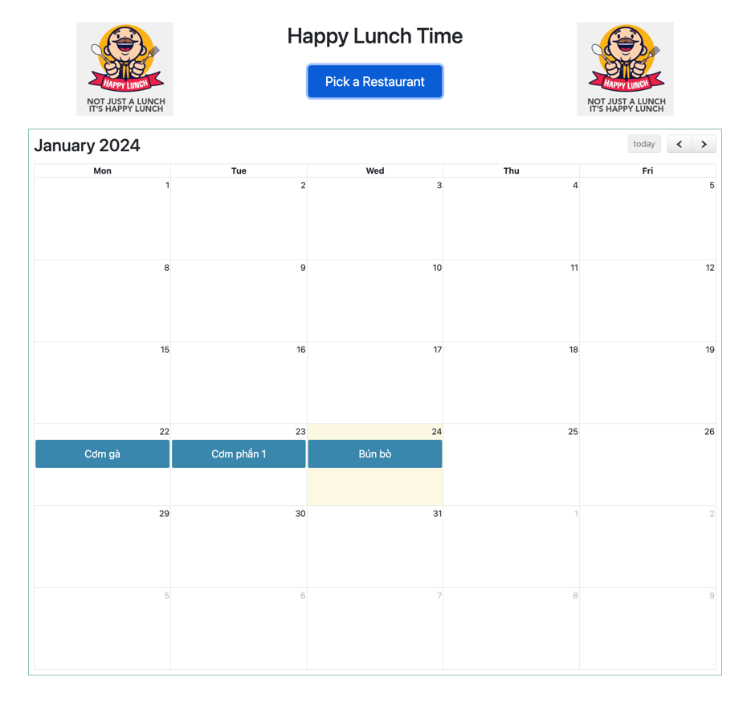

## Lunch time app

the app will choose randomly a restaurant

### update note:
add version 2:

- add ajax
- add feature 1 random per day
- add sandbox page (/sandbox)
- add notion query instead of local save

### link production

- normal: https://lunchtimeapp-production.up.railway.app/
- sandbox: https://lunchtimeapp-production.up.railway.app/sandbox

[//]: # (![img.png]&#40;img/img.png&#41;)

### using note
- ~~update list of restaurants in `listrestaurant.properties`~~
- đã update db dùng notion.so

### update soon
- add CRUD to update restaurant
- better UI experience

